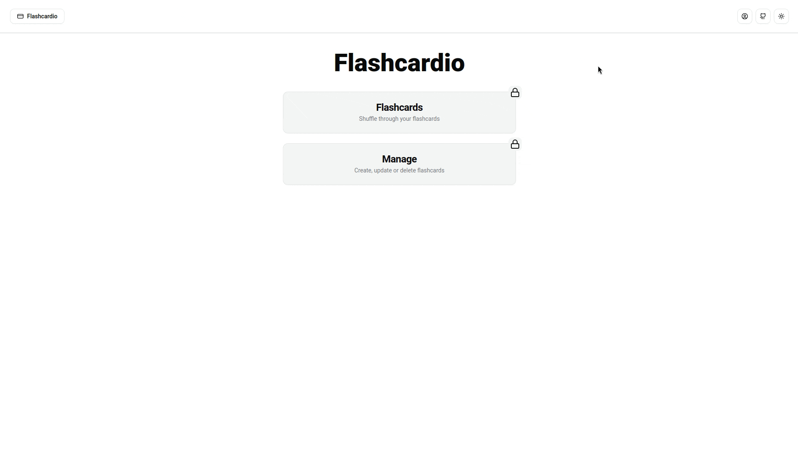
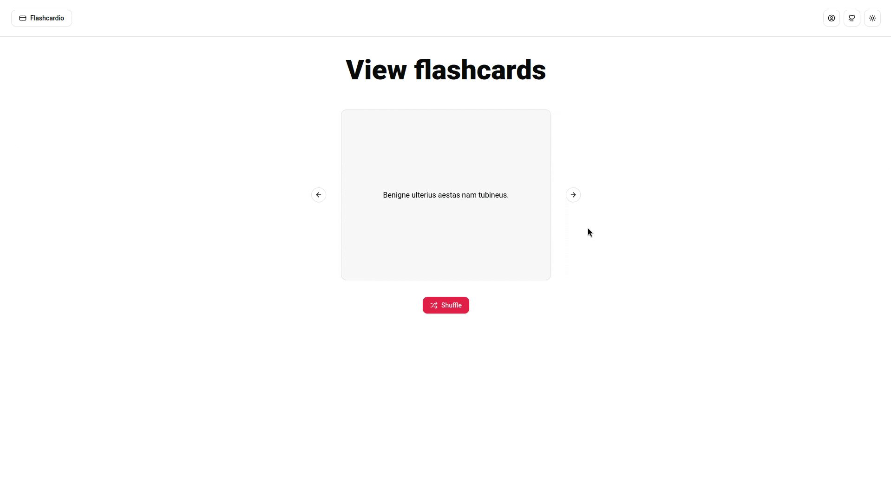
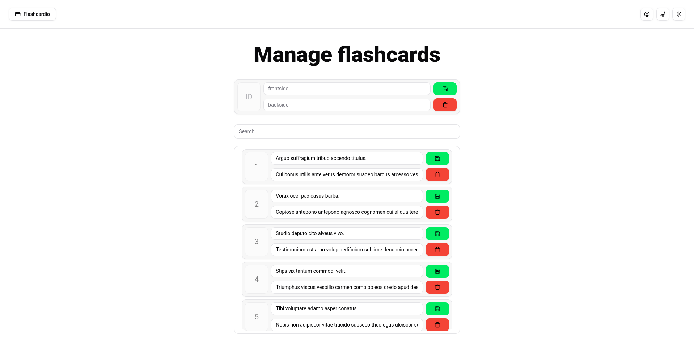
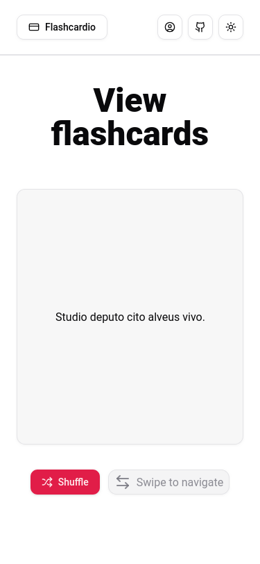

# Flashcard manager

A simple full stack web application built with [Vue](https://vuejs.org/) to showcase CRUD operations on flashcards.

## Features

- **User authentication**: Sign up and log in via username and password. The API uses [JWT](https://jwt.io/) for authentication.



- **Flashcard viewing**: View and manage flashcards using a moden UI, powered by the [shadcn-vue](https://www.shadcn-vue.com/) component library.



- **Flashcard management**: Create, read, update and delete flashcards. Flashcards are stored in a [Firebase database](https://firebase.google.com/) and can be accessed by the authenticated user. On the client side, the flashcards are stored using [Vuex](https://vuex.vuejs.org/).



- **Responsive design**: The application is designed to work on both desktop and mobile devices. The UI is built using [Tailwind CSS](https://tailwindcss.com/).



## API

### User Routes

#### Validate User Token

**GET** `/user/validate`

- **Description**: Validates the user's token and returns user information.
- **Access**: Private
- **Headers**:
  - `Authorization`: Bearer token
- **Responses**:
  - `200 OK`: Returns the username and a new token.
  - `401 Unauthorized`: User not found.
  - `500 Internal Server Error`: Internal server error.

#### Login User

**POST** `/user/login`

- **Description**: Logs in a user and returns a token.
- **Access**: Public
- **Request Body**:
  - `username`: String (required)
  - `password`: String (required)
- **Responses**:
  - `200 OK`: Returns the username and a token.
  - `400 Bad Request`: Username and password are required.
  - `401 Unauthorized`: Invalid credentials.
  - `500 Internal Server Error`: Internal server error.

#### Register User

**POST** `/user/register`

- **Description**: Registers a new user.
- **Access**: Public
- **Request Body**:
  - `username`: String (required)
  - `password`: String (required)
- **Responses**:
  - `201 Created`: Returns the username and a token.
  - `400 Bad Request`: Username and password are required or user already exists.
  - `500 Internal Server Error`: Internal server error.

### Flashcard Routes

#### Get All Flashcards

**GET** `/flashcards`

- **Description**: Gets all flashcards for the authenticated user.
- **Access**: Private
- **Headers**:
  - `Authorization`: Bearer token
- **Responses**:
  - `200 OK`: Returns an array of flashcards.
  - `500 Internal Server Error`: Internal server error.

#### Create Flashcard

**POST** `/flashcards`

- **Description**: Creates a new flashcard.
- **Access**: Private
- **Headers**:
  - `Authorization`: Bearer token
- **Request Body**:
  - `frontSide`: String (required)
  - `backSide`: String (required)
- **Responses**:
  - `201 Created`: Returns the created flashcard.
  - `400 Bad Request`: Front side and back side are required.
  - `500 Internal Server Error`: Internal server error.

#### Update Flashcard

**PUT** `/flashcards/:id`

- **Description**: Updates an existing flashcard.
- **Access**: Private
- **Headers**:
  - `Authorization`: Bearer token
- **Request Body**:
  - `frontSide`: String (required)
  - `backSide`: String (required)
- **Responses**:
  - `200 OK`: Returns the updated flashcard.
  - `400 Bad Request`: Front side and back side are required.
  - `404 Not Found`: Flashcard not found.
  - `500 Internal Server Error`: Internal server error.

#### Delete Flashcard

**DELETE** `/flashcards/:id`

- **Description**: Deletes an existing flashcard.
- **Access**: Private
- **Headers**:
  - `Authorization`: Bearer token
- **Responses**:
  - `200 OK`: Flashcard deleted.
  - `404 Not Found`: Flashcard not found.
  - `500 Internal Server Error`: Internal server error.

## Installation

1. Clone the repository and install dependencies:

```bash
git clone https://github.com/your-username/mti-flashcard-manager.git
cd mti-flashcard-manager/frontend
npm install
cd ../backend
npm install
```

2. Make sure you have the `backend/.env` file with the firestore configuration, and, optionally, the JWT secret:

```bash
JWT_KEY=
FIREBASE_PROJECT_ID=
FIREBASE_CLIENT_EMAIL=
FIREBASE_PRIVATE_KEY=
```

3. Start the backend and frontend server:

```bash
cd /backend
npm run dev
cd ../frontend
npm run dev
```
